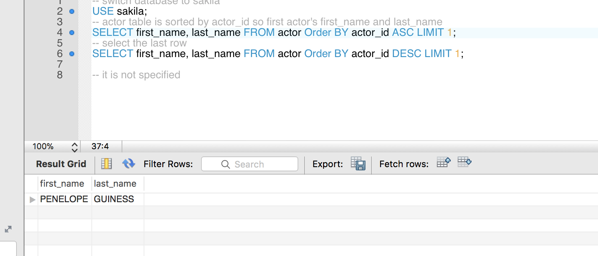
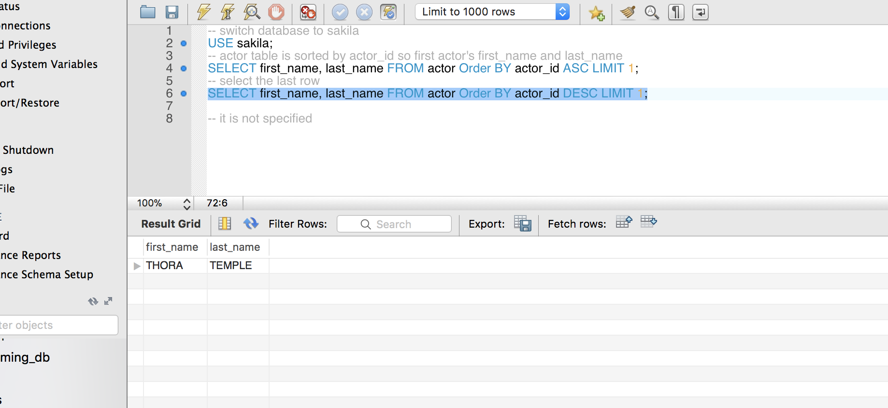

# Mysql_homework Yizhi Yin

## Question 1a. Display the first and last names of all actors from the table `actor`. 
```sql
-- switch database to sakila
USE sakila;
-- actor table is sorted by actor_id so first actor's first_name and last_name 
SELECT first_name, last_name FROM actor Order BY actor_id ASC LIMIT 1;
-- select the last row 
SELECT first_name, last_name FROM actor Order BY actor_id DESC LIMIT 1;



```

## Question 1b. Display the first and last name of each actor in a single column in upper case letters. Name the column `Actor Name`
```sql
-- i am goin to concat first_name and last_name with a separator ','
SELECT CONCAT_WS (',', first_name,last_name) AS Actor_Name
FROM actor;

```

## Question 2a. You need to find the ID number, first name, and last name of an actor, of whom you know only the first name, "Joe." What is one query would you use to obtain this information?
```sql
SELECT first_name, last_name, actor_id 
FROM actor
WHERE first_name='Joe';

```

## Question 2b. Find all actors whose last name contain the letters `GEN`:
```sql
SELECT * FROM actor
WHERE last_name LIKE "%GEN%";

```

## Question 2c. Find all actors whose last names contain the letters `LI`. This time, order the rows by last name and first name, in that order:
```sql
-- the question does not specify if we order ascedning or descending so I go with ASC
SELECT * FROM actor
WHERE last_name LIKE"%LI%"
ORDER BY last_name ASC, first_name ASC;

```

## Question 2d. Using `IN`, display the `country_id` and `country` columns of the following countries: Afghanistan, Bangladesh, and China:
```sql
SELECT country_id, country
FROM country
WHERE country IN ('Afghanistan', 'Bangladesh', 'China');


```
## Question 3a. Add a `middle_name` column to the table `actor`. Position it between `first_name` and `last_name`. Hint: you will need to specify the data type.
```sql
ALTER TABLE actor ADD middle_name VARCHAR(50) AFTER first_name;
-- uncomment the line below to see the changed table
-- SELECT * FROM actor LIMIT 5;

```

## Question 3b. You realize that some of these actors have tremendously long last names. Change the data type of the `middle_name` column to `blobs`.
```sql
-- I do not understand we change the type of middle_name if the last name is too long, but whatever
ALTER TABLE actor MODIFY middle_name BLOB;
-- uncomment the line below to see the field type has been changed
-- DESCRIBE actor;

```

## Question 3c. Now delete the `middle_name` column.
```sql
ALTER TABLE actor DROP middle_name;
-- uncomment the line below to see the field type has been changed
-- DESCRIBE actor;

```

## Question 4a. List the last names of actors, as well as how many actors have that last name.
```sql
SELECT 
    last_name, 
    COUNT(*) AS Last_Name_Count
FROM 
	actor
GROUP BY
	last_name;


```
## Question 4b. List last names of actors and the number of actors who have that last name, but only for names that are shared by at least two actors.
```sql
SELECT 
    last_name, 
    COUNT(*) AS Last_Name_Count
FROM 
	actor
GROUP BY
	last_name
HAVING COUNT(*)>=2;


```

## Question 4c. Oh, no! The actor `HARPO WILLIAMS` was accidentally entered in the `actor` table as `GROUCHO WILLIAMS`, the name of Harpo's second cousin's husband's yoga teacher. Write a query to fix the record.
```sql
UPDATE actor
SET first_name='HARPO'
WHERE first_name='GROUCHO' and last_name='WILLIAMS';
-- uncomment lines below to see the change
-- SELECT * FROM actor
-- WHERE first_name='HARPO' and last_name='WILLIAMS';

```

## Question 4d. Perhaps we were too hasty in changing `GROUCHO` to `HARPO`. It turns out that `GROUCHO` was the correct name after all! In a single query, if the first name of the actor is currently `HARPO`, change it to `GROUCHO`. Otherwise, change the first name to `MUCHO GROUCHO`, as that is exactly what the actor will be with the grievous error. BE CAREFUL NOT TO CHANGE THE FIRST NAME OF EVERY ACTOR TO `MUCHO GROUCHO`, HOWEVER! (Hint: update the record using a unique identifier.)
```sql
UPDATE actor
SET 
    -- IF first_name='HARPO' change into 'GROUCHO' else 'MUCHO GROUCHO'
	first_name= IF(first_name= `HARPO`, 'GROUCHO', 'MUCHO GROUCHO')
WHERE 
	actor_id=172;

-- uncomment lines below to see the change   
-- SELECT * FROM actor
-- WHERE actor_id=172;

```

