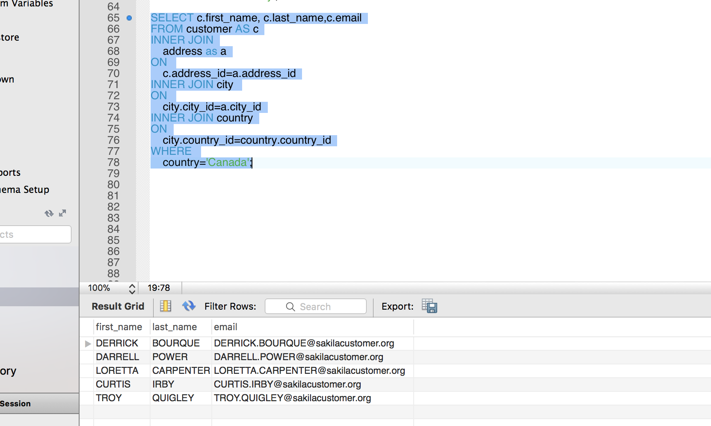
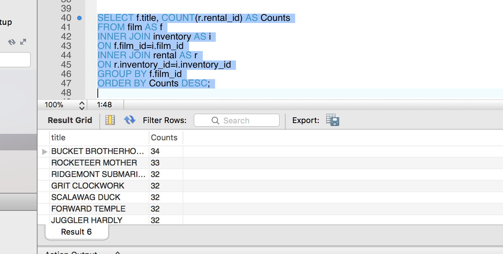
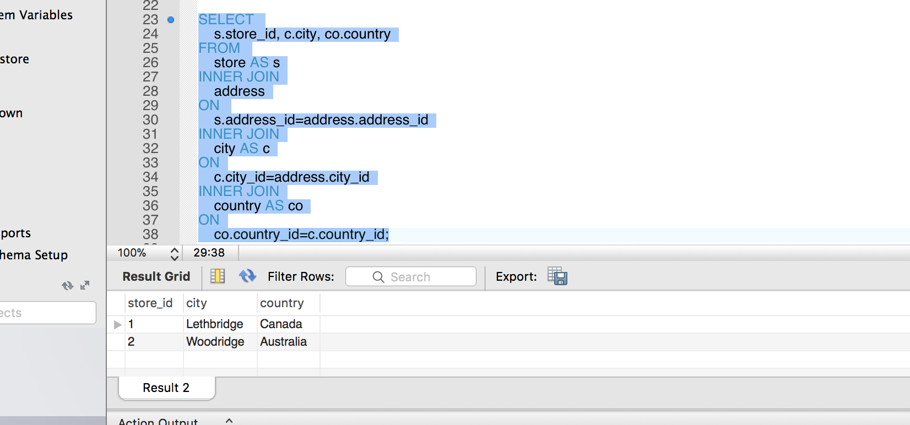
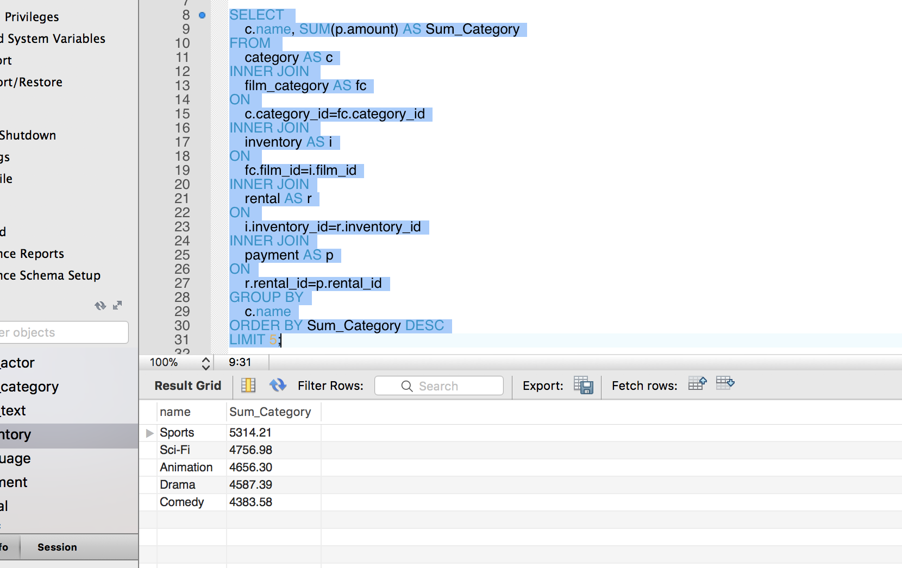

# Mysql_homework Yizhi Yin

## Question 1a. Display the first and last names of all actors from the table `actor`. 
```sql
-- switch database to sakila
USE sakila;
-- actor table is sorted by actor_id so first actor's first_name and last_name 
SELECT first_name, last_name FROM actor Order BY actor_id ASC LIMIT 1;
-- select the last row 
SELECT first_name, last_name FROM actor Order BY actor_id DESC LIMIT 1;


```

## Question 1b. Display the first and last name of each actor in a single column in upper case letters. Name the column `Actor Name`
```sql
-- i am goin to concat first_name and last_name with a separator ',' they are already in upper case
SELECT CONCAT_WS (',', first_name,last_name) AS Actor_Name
FROM actor;

```

## Question 2a. You need to find the ID number, first name, and last name of an actor, of whom you know only the first name, "Joe." What is one query would you use to obtain this information?
```sql
SELECT first_name, last_name, actor_id 
FROM actor
WHERE first_name='Joe';

```

## Question 2b. Find all actors whose last name contain the letters `GEN`:
```sql
SELECT * FROM actor
WHERE last_name LIKE "%GEN%";

```

## Question 2c. Find all actors whose last names contain the letters `LI`. This time, order the rows by last name and first name, in that order:
```sql
-- the question does not specify if we order ascedning or descending so I go with ASC
SELECT * FROM actor
WHERE last_name LIKE"%LI%"
ORDER BY last_name ASC, first_name ASC;

```

## Question 2d. Using `IN`, display the `country_id` and `country` columns of the following countries: Afghanistan, Bangladesh, and China:
```sql
SELECT country_id, country
FROM country
WHERE country IN ('Afghanistan', 'Bangladesh', 'China');


```
## Question 3a. Add a `middle_name` column to the table `actor`. Position it between `first_name` and `last_name`. Hint: you will need to specify the data type.
```sql
ALTER TABLE actor ADD middle_name VARCHAR(50) AFTER first_name;
-- uncomment the line below to see the changed table
-- SELECT * FROM actor LIMIT 5;

```

## Question 3b. You realize that some of these actors have tremendously long last names. Change the data type of the `middle_name` column to `blobs`.
```sql
-- I do not understand we change the type of middle_name if the last name is too long, but whatever
ALTER TABLE actor MODIFY middle_name BLOB;
-- uncomment the line below to see the field type has been changed
-- DESCRIBE actor;

```

## Question 3c. Now delete the `middle_name` column.
```sql
ALTER TABLE actor DROP middle_name;
-- uncomment the line below to see the field type has been changed
-- DESCRIBE actor;

```

## Question 4a. List the last names of actors, as well as how many actors have that last name.
```sql
SELECT 
    last_name, 
    COUNT(*) AS Last_Name_Count
FROM 
	actor
GROUP BY
	last_name;


```
## Question 4b. List last names of actors and the number of actors who have that last name, but only for names that are shared by at least two actors.
```sql
SELECT 
    last_name, 
    COUNT(*) AS Last_Name_Count
FROM 
	actor
GROUP BY
	last_name
HAVING COUNT(*)>=2;


```

## Question 4c. Oh, no! The actor `HARPO WILLIAMS` was accidentally entered in the `actor` table as `GROUCHO WILLIAMS`, the name of Harpo's second cousin's husband's yoga teacher. Write a query to fix the record.
```sql
UPDATE actor
SET first_name='HARPO'
WHERE first_name='GROUCHO' and last_name='WILLIAMS';
-- uncomment lines below to see the change
-- SELECT * FROM actor
-- WHERE first_name='HARPO' and last_name='WILLIAMS';

```

## Question 4d. Perhaps we were too hasty in changing `GROUCHO` to `HARPO`. It turns out that `GROUCHO` was the correct name after all! In a single query, if the first name of the actor is currently `HARPO`, change it to `GROUCHO`. Otherwise, change the first name to `MUCHO GROUCHO`, as that is exactly what the actor will be with the grievous error. BE CAREFUL NOT TO CHANGE THE FIRST NAME OF EVERY ACTOR TO `MUCHO GROUCHO`, HOWEVER! (Hint: update the record using a unique identifier.)
```sql
UPDATE actor
SET 
    -- IF first_name='HARPO' change into 'GROUCHO' else 'MUCHO GROUCHO'
	first_name= IF(first_name= `HARPO`, 'GROUCHO', 'MUCHO GROUCHO')
WHERE 
	actor_id=172;

-- uncomment lines below to see the change   
-- SELECT * FROM actor
-- WHERE actor_id=172;

```

## Question 5. You cannot locate the schema of the `address` table. Which query would you use to re-create it?
```sql
SHOW CREATE TABLE address;

```

## Question 6a. Use `JOIN` to display the first and last names, as well as the address, of each staff member. Use the tables `staff` and `address`:
```sql
SELECT staff.first_name, staff.last_name, address. address
FROM staff 
INNER JOIN address
ON staff.address_id=address.address_id;

```

## Question 6b. Use `JOIN` to display the total amount rung up by each staff member in August of 2005. Use tables `staff` and `payment`.
```sql
SELECT 
	s.first_name, s.last_name, p.SUM_Aug
FROM 
	staff AS s
INNER JOIN
	(SELECT 
		staff_id, SUM(amount) AS SUM_Aug
        FROM payment
        WHERE DATE(payment_date) BETWEEN '2005-08-01' AND '2005-08-31'
        GROUP BY staff_id) AS p
ON s.staff_id=p.staff_id;

```

## Question 6c. List each film and the number of actors who are listed for that film. Use tables `film_actor` and `film`. Use inner join.
```sql
SELECT 
	f.title, a.actor_counts
FROM 
	film AS f
INNER JOIN 
	(SELECT 
		film_id, COUNT(actor_id) AS actor_counts
		FROM film_actor
		GROUP BY film_id) AS a
ON f.film_id=a.film_id;

```

## Question 6d. How many copies of the film `Hunchback Impossible` exist in the inventory system?
```sql
SELECT COUNT(*) AS copy
FROM 
	inventory
WHERE 
	film_id=(SELECT film_id 
					FROM film
                    WHERE title='Hunchback Impossible'
                    );


```

## Question 6e. Using the tables `payment` and `customer` and the `JOIN` command, list the total paid by each customer. List the customers alphabetically by last name:
```sql
SELECT c.first_name, c.last_name, p.Total_Amount_Paid
FROM customer AS c
-- USE left join just incase some customer does not pay (unlikely but still better to be safe)
LEFT JOIN 
				(SELECT 
					customer_id, SUM(amount) as Total_Amount_Paid
					FROM 
						payment
					GROUP BY 
						customer_id) AS p
ON c.customer_id=p.customer_id
ORDER BY c.last_name ASC;


```

## Question 7a. The music of Queen and Kris Kristofferson have seen an unlikely resurgence. As an unintended consequence, films starting with the letters `K` and `Q` have also soared in popularity. Use subqueries to display the titles of movies starting with the letters `K` and `Q` whose language is English.
```sql
SELECT title
FROM film
WHERE 
	(title LIKE "K%"  OR title LIKE "Q%") 
AND 
	(language_id=
				(SELECT language_id 
				FROM language
				WHERE name='English')
				);


```

## Question 7b. Use subqueries to display all actors who appear in the film `Alone Trip`.
```sql
SELECT first_name, last_name
FROM actor
WHERE actor_id 
IN 
	(SELECT actor_id 
	FROM film_actor
	WHERE film_id 
	IN 
		(SELECT film_id
		FROM film
		WHERE title='Alone Trip')
        );


```

## Question 7c. You want to run an email marketing campaign in Canada, for which you will need the names and email addresses of all Canadian customers. Use joins to retrieve this information.
```sql
-- this problem ask to use join but it can also be solved by using where I did both ways
-- USE join to solve this problem
SELECT t1.first_name, t1.last_name, t1.email
FROM 
			(SELECT c.first_name, c.last_name,c.email,a.city_id
			FROM customer  AS c
			INNER JOIN address AS a
			ON c.address_id=a.address_id) AS t1
INNER JOIN 
			(SELECT city_id 
			FROM city
			WHERE country_id 
			IN 
				(SELECT country_id
				FROM country
				WHERE country='Canada')
				) AS t2
ON t1.city_id=t2.city_id;

-- USE SELECT WHERE
SELECT first_name, last_name,email
FROM customer
WHERE address_id
IN 
	(SELECT address_id 
	FROM address
	WHERE city_id 
	IN 
		(SELECT city_id 
					FROM city
					WHERE country_id 
					IN 
						(SELECT country_id
						FROM country
						WHERE country='Canada')
						) 
						);



```

## Question 7d. Sales have been lagging among young families, and you wish to target all family movies for a promotion. Identify all movies categorized as famiy films.
```sql
-- seems using join is faster than using where IN 
-- USE join to solve this problem
SELECT f.title
FROM film AS f
INNER JOIN
			(SELECT fc.film_id 
			 FROM film_category AS fc
			 INNER JOIN 
						(SELECT category_id
						FROM category
						WHERE name='Family') as c
			ON fc.category_id=c.category_id) AS t
ON f.film_id=t.film_id;

-- USE SELECT WHERE IN
SELECT title
FROM film
WHERE film_id 
IN 
	(
		(SELECT film_id
		FROM film_category 
		WHERE category_id 
		IN 
			(SELECT category_id
			 FROM category
			 WHERE name='Family')
			)
	);


```

## Question 7e. Display the most frequently rented movies in descending order..
```sql
SELECT 
	f.title, SUM(t3.inventory_id_counts) AS times_rented
FROM 
	film AS f
INNER JOIN 
		(SELECT 
			t1.film_id,t2.inventory_id_counts,t2.inventory_id
		FROM 
			inventory as t1
		INNER JOIN 
					(SELECT 
						inventory_id, COUNT(*) as inventory_id_counts
					FROM 
						rental
					GROUP BY 
						inventory_id
                        ) as t2
		ON t1.inventory_id=t2.inventory_id
        ) AS t3
ON 
	f.film_id=t3.film_id
GROUP BY 
	t3.film_id
ORDER BY 
	times_rented DESC;

```

## Question 7f. Write a query to display how much business, in dollars, each store brought in.
```sql
SELECT 
	a.address, t2.store_id,t2.revenue_store
FROM 
	address AS a
INNER JOIN
	(SELECT 
		s.address_id,s.store_id,SUM(t1.revenue_staff) AS revenue_store
		FROM store as s
		INNER JOIN 
		(SELECT 
			staff_id,SUM(amount) AS revenue_staff
		FROM 
			payment
		GROUP BY 
			staff_id
            ) as t1
	ON 
		s.manager_staff_id=t1.staff_id
	GROUP BY 
		s.store_id
        ) as t2
ON 
	a.address_id=t2.address_id;


```

## Question 7g. Write a query to display for each store its store ID, city, and country.
```sql
SELECT t2.store_id, t2.city, (SELECT country FROM country WHERE country.country_id=t2.country_id) AS country
FROM 
	(SELECT c.city,c.country_id, t1.store_id
	FROM city AS c
	INNER JOIN
		(SELECT 
			store_id, (SELECT 
								city_id 
							FROM 
								address 
							WHERE 
								store.address_id = address.address_id
							) AS city_id
		FROM store
		) AS t1
	ON c.city_id=t1.city_id
    ) AS t2;

```

## Question 7h. List the top five genres in gross revenue in descending order. (**Hint**: you may need to use the following tables: category, film_category, inventory, payment, and rental.)
```sql
SELECT 
	c.name, SUM(t3.sum_rental) AS sum_category
FROM  
	film_category AS fc
INNER JOIN 
	category AS c
ON fc.category_id=c.category_id
INNER JOIN 
	(SELECT
		i.film_id, t2.sum_rental 
	FROM inventory AS i
	INNER JOIN 
		(SELECT 
			r.inventory_id, t1.sum_rental, t1.rental_id
		FROM rental AS r
		INNER JOIN 
			(SELECT 
				rental_id,SUM(amount) AS sum_rental
			FROM payment
			GROUP BY rental_id
            ) AS t1
		ON r.rental_id=t1.rental_id
        ) AS t2 
	ON i.inventory_id=t2.inventory_id
	) AS t3
ON fc.film_id=t3.film_id
GROUP BY fc.category_id
ORDER BY sum_category DESC
LIMIT 5;

```

## Question 8a. In your new role as an executive, you would like to have an easy way of viewing the Top five genres by gross revenue. Use the solution from the problem above to create a view. If you haven't solved 7h, you can substitute another query to create a view.
```sql
CREATE VIEW 
	TOP_5_GENRE
AS SELECT *
FROM  
(SELECT c.name, SUM(t3.sum_rental) AS sum_category
FROM  
	film_category AS fc
INNER JOIN 
	category AS c
ON fc.category_id=c.category_id
INNER JOIN 
	(SELECT
		i.film_id, t2.sum_rental 
	FROM inventory AS i
	INNER JOIN 
		(SELECT 
			r.inventory_id, t1.sum_rental, t1.rental_id
		FROM rental AS r
		INNER JOIN 
			(SELECT 
				rental_id,SUM(amount) AS sum_rental
			FROM payment
			GROUP BY rental_id
            ) AS t1
		ON r.rental_id=t1.rental_id
        ) AS t2 
	ON i.inventory_id=t2.inventory_id
	) AS t3
ON fc.film_id=t3.film_id
GROUP BY fc.category_id
ORDER BY sum_category DESC
LIMIT 5) AS t4;


```
## Question 8b. How would you display the view that you created in 8a?
```sql
SELECT * FROM  top_5_genre;


```
## Question 8c. You find that you no longer need the view `top_five_genres`. Write a query to delete it.
```sql
DROP VIEW top_5_genre;


```
